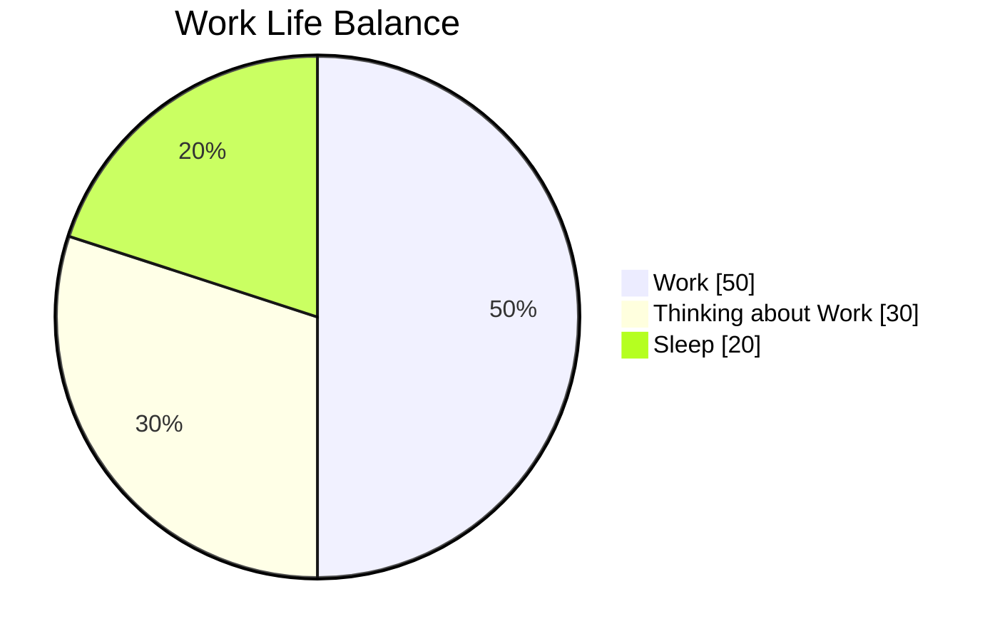
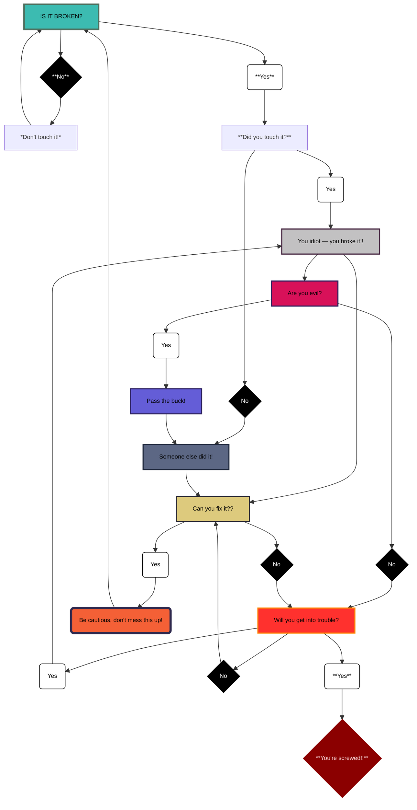

## Work Life Balance
> [!WARNING]
> Urgent content that requires immediate user focus due to possible risks.

“Don’t Fix What Isn’t Broken?”

## A highly scientific 
> decision making framework.

[:arrow_up:](#top) *Back to Top*

