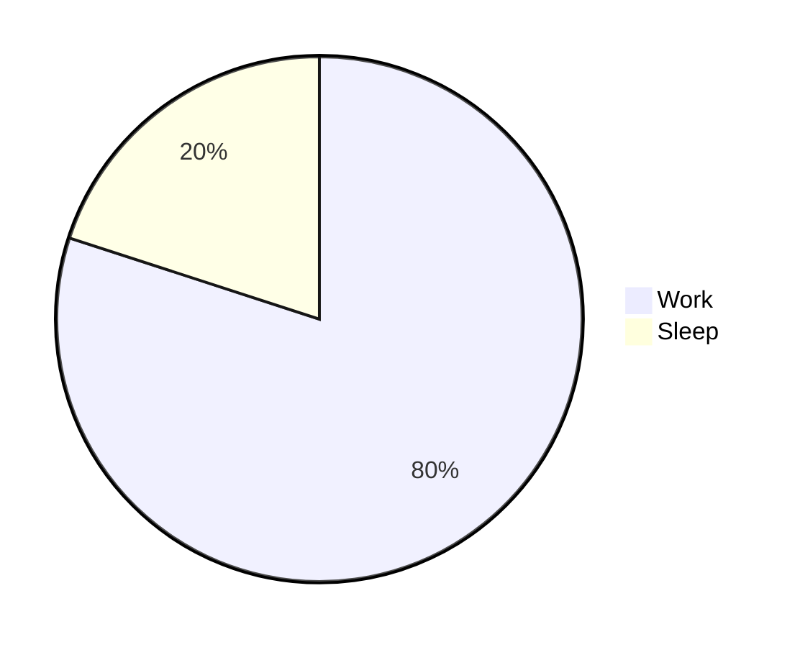
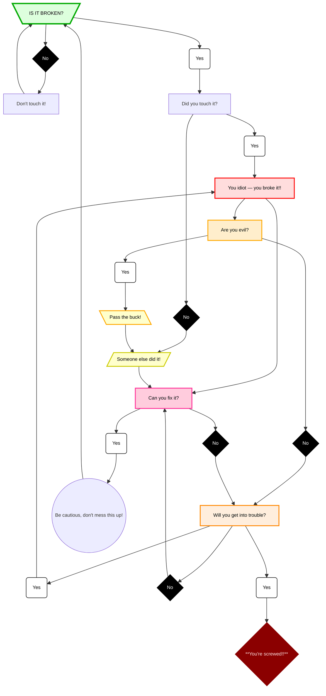

## Work Life Balance
> [!WARNING]
> Urgent content that requires immediate user focus due to possible risks.

## “Don’t Fix What Isn’t Broken?” 
> A highly scientific decision making framework.

[:arrow_up:](#top) *Back to top*
